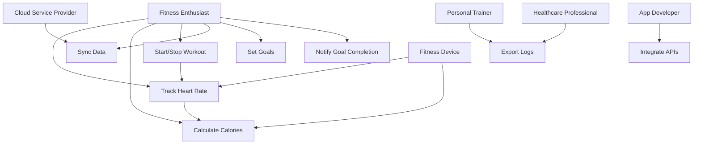

# USE_CASES_AND_TESTS.md
## Use Case Diagram for Real-Time Fitness Tracker

# USE_CASES_AND_TESTS.md
## Use Case Diagram for Real-Time Fitness Tracker

# USE_CASES_AND_TESTS.md
## Use Case Diagram for Real-Time Fitness Tracker

### Diagram

### Explanation
**Actors**:
  - *Fitness Enthusiast*: Primary user, tracks workouts and sets goals (FR1, FR7).
  - *Personal Trainer*: Exports logs to monitor clients (FR5 concern).
  - *App Developer*: Configures API integrations (FR6 concern).
  - *Cloud Service Provider*: Ensures data sync (FR4 concern).
  - *Healthcare Professional*: Uses logs for health insights (FR5 concern).
  - *Fitness Device*: Provides sensor data (FR1, FR2).
- **Relationships**:
  - "Calculate Calories" includes "Track Heart Rate" (needs heart rate data).
  - "Start/Stop Workout" triggers "Track Heart Rate."
- **Stakeholder Concerns**:
  - Fitness Enthusiast: Real-time feedback (UC1, UC8).
  - Personal Trainer: Data access (UC5).
  - Cloud Provider: Reliable sync (UC4).

### Use Case Specifications

### UC1: Track Heart Rate
- **Description**: Displays the user’s heart rate in real time during a workout.
- **Preconditions**: User is logged in, workout session is active, Fitness Device is connected.
- **Postconditions**: Heart rate is displayed and logged in the system.
- **Basic Flow**:
  1. User starts a workout session (UC3).
  2. System requests heart rate data from Fitness Device.
  3. System displays heart rate, updating every 1 second.
- **Alternative Flow**:
  - A1: If Fitness Device disconnects, system prompts user to reconnect within 30 seconds or use manual input.

### UC2: Calculate Calories
- **Description**: Computes and displays calories burned based on heart rate and activity type.
- **Preconditions**: Heart rate tracking is active (UC1).
- **Postconditions**: Calories burned are displayed and logged.
- **Basic Flow**:
  1. System retrieves real-time heart rate data (UC1).
  2. User selects activity type (e.g., running).
  3. System calculates calories using the MET formula.
  4. System displays the result.
- **Alternative Flow**:
  - A1: If no activity type is selected, system defaults to “walking” and notifies user.

### UC3: Start/Stop Workout
- **Description**: Allows the user to begin or end a workout session.
- **Preconditions**: User is logged in.
- **Postconditions**: Workout session is active or terminated, data is saved.
- **Basic Flow**:
  1. User taps “Start Workout.”
  2. System initiates heart rate tracking (UC1).
  3. User taps “Stop Workout.”
  4. System ends session and saves data.
- **Alternative Flow**:
  - A1: If “Stop” isn’t tapped, system auto-saves after 2 hours of inactivity.

### UC4: Sync Data
- **Description**: Uploads workout data to the cloud for storage and access.
- **Preconditions**: Workout session has ended, internet connection is available.
- **Postconditions**: Data is stored in the cloud.
- **Basic Flow**:
  1. System detects workout end (UC3).
  2. System uploads data to Cloud Service Provider.
  3. System confirms sync completion with a notification.
- **Alternative Flow**:
  - A1: If no internet, system queues data and retries sync when connected.

### UC5: Export Logs
- **Description**: Generates a CSV file of workout logs for user or trainer review.
- **Preconditions**: User has completed at least one workout, is logged in.
- **Postconditions**: CSV file is generated and available for download.
- **Basic Flow**:
  1. User selects “Export Logs.”
  2. System compiles workout data into a CSV format.
  3. System provides download link or saves file.
- **Alternative Flow**:
  - A1: If no data exists, system displays “No logs available.”

### UC6: Integrate APIs
- **Description**: Connects the system with external fitness APIs (e.g., Google Fit).
- **Preconditions**: App Developer has configured API keys, user enables integration.
- **Postconditions**: Data is synced with the external API.
- **Basic Flow**:
  1. User enables API integration in settings.
  2. System authenticates with the external API.
  3. System syncs workout data bidirectionally.
- **Alternative Flow**:
  - A1: If authentication fails, system prompts user to re-enter credentials.

### UC7: Set Goals
- **	Description**: Allows user to define fitness targets (e.g., calorie burn).
- **Preconditions**: User is logged in.
- **Postconditions**: Goal is saved and active in the system.
- **Basic Flow**:
  1. User selects “Set Goal.”
  2. User inputs target (e.g., burn 500 calories).
  3. System validates and saves the goal.
- **Alternative Flow**:
  - A1: If target is invalid (e.g., negative), system prompts correction.

### UC8: Notify Goal Completion
- **Description**: Alerts user when a fitness goal is achieved.
- **Preconditions**: Goal is set (UC7), workout is active.
- **Postconditions**: User receives a notification, goal status updates.
- **Basic Flow**:
  1. System monitors calories burned (UC2).
  2. System detects goal threshold is met (e.g., 500 calories).
  3. System sends a notification within 2 seconds.
- **Alternative Flow**:
  - A1: If notifications are disabled, system logs completion silently.
  ## Test Cases

### Functional Test Cases
| Test Case ID | Requirement ID | Description                  | Steps                                    | Expected Result                  | Actual Result | Status |
|--------------|----------------|------------------------------|------------------------------------------|----------------------------------|---------------|--------|
| TC-001       | FR1            | Verify heart rate display    | 1. Start workout. 2. Check display.      | Updates every 1 sec, 95% accurate| TBD           | TBD    |
| TC-002       | FR2            | Verify calorie calculation   | 1. Track heart rate. 2. Select “Running.” 3. Check calories. | Matches MET within 5%       | TBD           | TBD    |
| TC-003       | FR3            | Verify workout start/stop    | 1. Tap “Start.” 2. Tap “Stop.”           | Session starts, ends, data saved | TBD           | TBD    |
| TC-004       | FR4            | Verify data sync             | 1. End workout. 2. Check cloud.          | Syncs within 10 sec              | TBD           | TBD    |
| TC-005       | FR5            | Verify log export            | 1. Select “Export Logs.” 2. Download.    | CSV file generated               | TBD           | TBD    |
| TC-006       | FR6            | Verify API integration       | 1. Enable Google Fit. 2. Sync data.      | Data shared with API             | TBD           | TBD    |
| TC-007       | FR7            | Verify goal setting          | 1. Set 500-calorie goal. 2. Save.        | Goal saved                       | TBD           | TBD    |
| TC-008       | FR8            | Verify goal notification     | 1. Set goal. 2. Burn 500 calories.       | Notification within 2 sec        | TBD           | TBD    |

### Non-Functional Test Cases
| Test Case ID | Requirement ID | Description                  | Steps                                    | Expected Result                  | Actual Result | Status |
|--------------|----------------|------------------------------|------------------------------------------|----------------------------------|---------------|--------|
| TC-NF-001    | NFR6           | Verify data security         | 1. Sync data. 2. Inspect transmission.   | AES-256 encryption used          | TBD           | TBD    |
| TC-NF-002    | NFR8           | Verify performance under load| 1. Simulate 10,000 users tracking HR. 2. Measure time. | Updates in 1 sec on 4G   | TBD           | TBD    |
