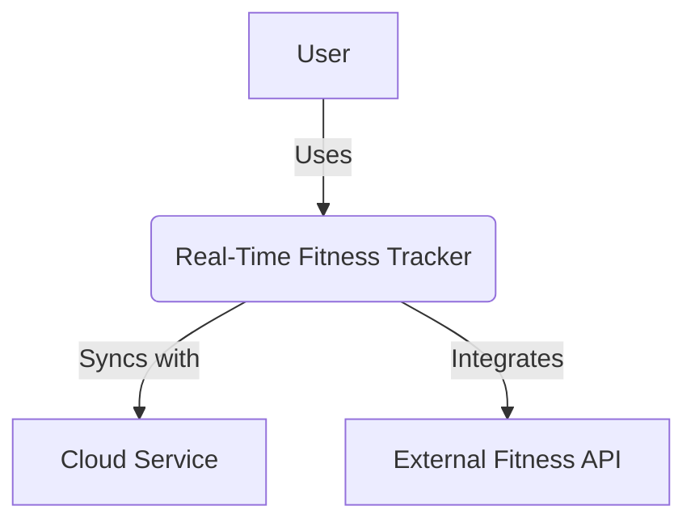

# ARCHITECTURE.md
# ARCHITECTURE.md
## Real-Time Fitness Tracker
### Domain
Health & Fitness – A system for monitoring physical activity in real time.

### Problem Statement
Provide immediate feedback on workouts to improve training efficiency.

### Individual Scope
Feasible using mobile sensors and a lightweight backend.
- **A[User]**: The person using the system.
- **B(Real-Time Fitness Tracker)**: Your system as a whole.
- **C[Cloud Service]**: For storing workout data.
- **D[External Fitness API]**: Optional, e.g., Google Fit for extra data.

---
## Context Diagram
The Real-Time Fitness Tracker allows users to monitor their fitness data and syncs with a cloud service for storage and analysis.


graph TD;
    A[User] -->|Interacts with| B[Mobile App]
    B -->|Reads| C[Mobile Device Sensors]
    B -->|Sends data to| D[Backend API]
    D -->|Stores/Retrieves| E[Database]
    D -->|Queries| F[External Fitness API];
```
graph TD;
    A[User] -->|Interacts with| B[UI Layer]
    B -->|Calls| C[Data Processor]
    C -->|Fetches data from| D[Sensor Interface]
    D -->|Reads| E[Mobile Device Sensors]
    C -->|Sends to| F[Backend API];
```
#### 2. Container Diagram
**Purpose**: Breaks the system into "containers" (standalone deployable units like apps, databases, etc.) and shows their interactions.  
**Example**: The Fitness Tracker has a mobile app, a backend API, and a database.
- **B[Mobile App]**: The app users download.
- **C[Mobile Device Sensors]**: Built-in hardware (e.g., heart rate monitor).
- **D[Backend API]**: Handles data processing.
- **E[Database]**: Stores workout history.
- **F[External Fitness API]**: Optional integration.

---

#### 3. Component Diagram
**Purpose**: Zooms into one container (e.g., the Mobile App) to show its internal components.  
**Example**: Inside the Mobile App, there’s a UI, a data processor, and a sensor interface.

```mermaid
graph TD
    A[User] -->|Interacts with| B[Mobile App]
    B -->|Reads| C[Mobile Device Sensors]
    B -->|Sends data to| D[Backend API]
    D -->|Stores/Retrieves| E[Database]
    D -->|Queries| F[External Fitness API]
 ```
- **B[UI Layer]**: Displays workout stats to the user.
- **C[Data Processor]**: Calculates calories, aggregates data.
- **D[Sensor Interface]**: Connects to device sensors.
- **F[Backend API]**: Links back to the container diagram.

---

