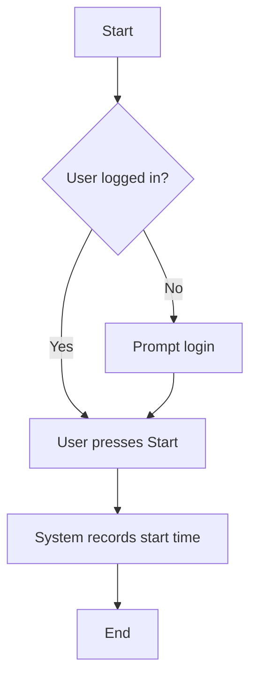
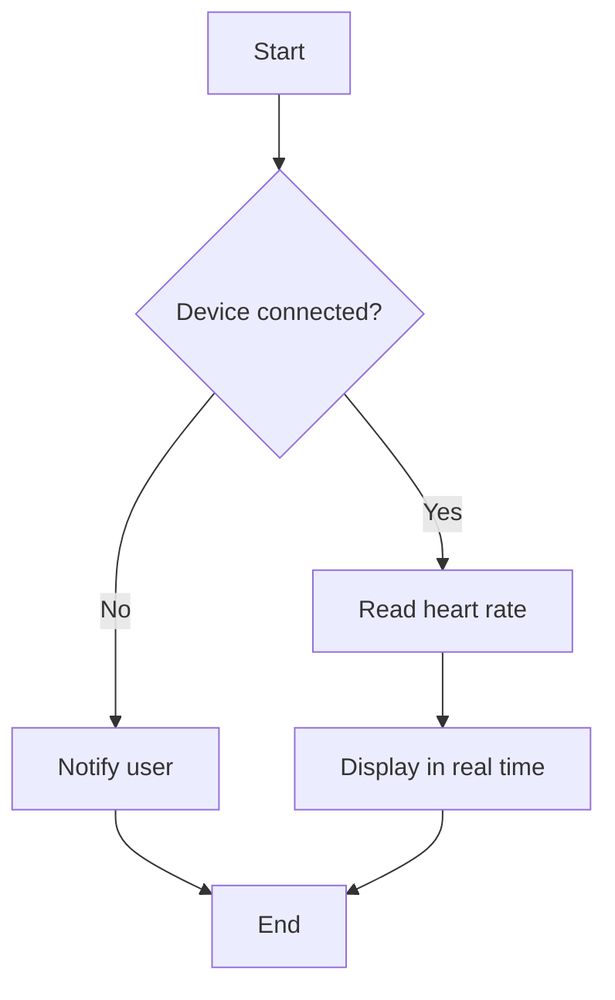
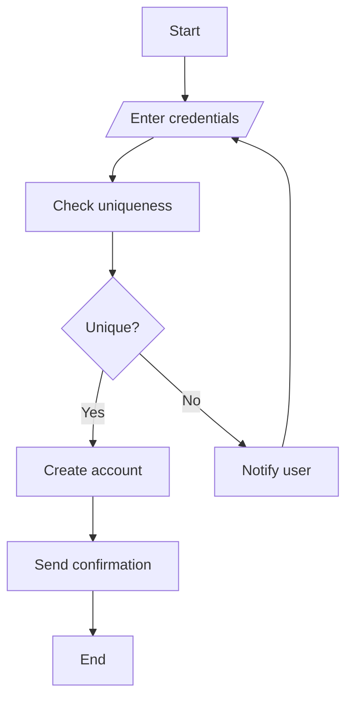
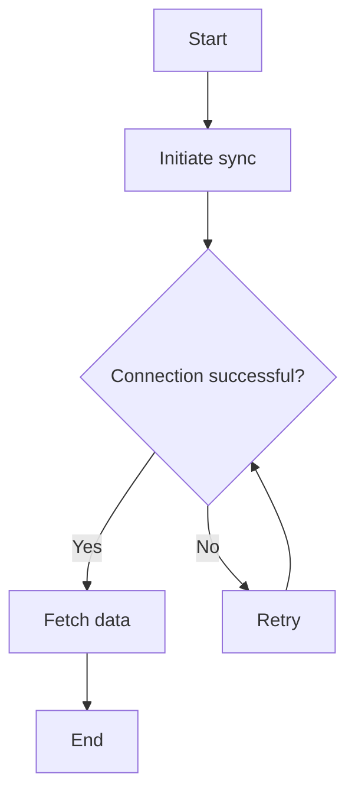
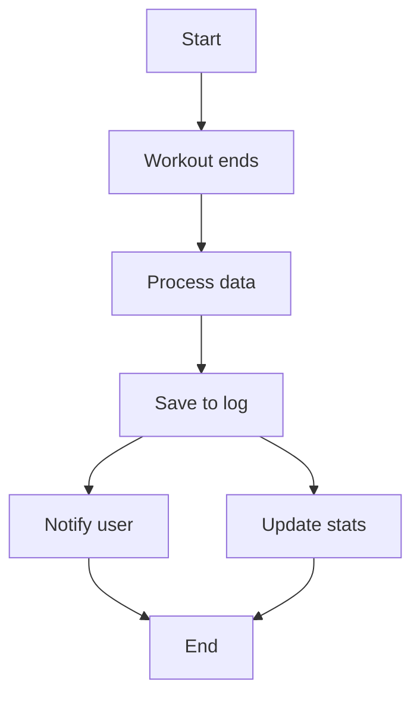
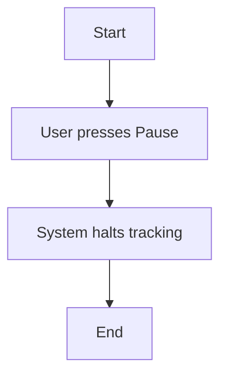

# activity_diagrams.md

## 1. Start Workout


**Explanation:** This workflow ensures a logged-in user starts a workout (US-003), addressing the fitness enthusiast’s need for seamless tracking (FR-003).

## 2. Track Heart Rate

**Explanation:** Real-time heart rate tracking (US-001, FR-001) meets the enthusiast’s monitoring needs, with a decision for connectivity.

## 3. Calculate Calories
```mermaid
flowchart TD
    A[Start] --> B[Collect activity data]
    B --> C[Calculate calories] --> D{Valid data?}
    D -->|Yes| E[Update UI] --> F[End]
    D -->|No| G[Retry calculation] --> C
 ```

**Explanation:** Calorie calculation (US-002, FR-002) ensures accurate feedback for users.

## 4. Set Fitness Goal
```mermaid
flowchart TD
    A[Start] --> B[/User enters goal/] --> C[Validate input]
    C --> D{Valid?}
    D -->|Yes| E[Save goal] --> F[End]
    D -->|No| G[Prompt correction] --> B
```

**Explanation:** Goal setting (US-007, FR-007) supports user motivation with validation.

## 5. User Registration


**Explanation:** Registration ensures user-specific data (FR-001), addressing scalability.

## 6. Sync Device


**Explanation:** Device sync (US-012, FR-012) ensures data accuracy for the developer stakeholder.

## 7. Save Workout Log

**Explanation:** Logging (FR-004) meets the enthusiast’s history tracking need with parallel actions.

## 8. Pause Workout


**Explanation:** Pausing (US-003) offers flexibility, addressing user control.
    
