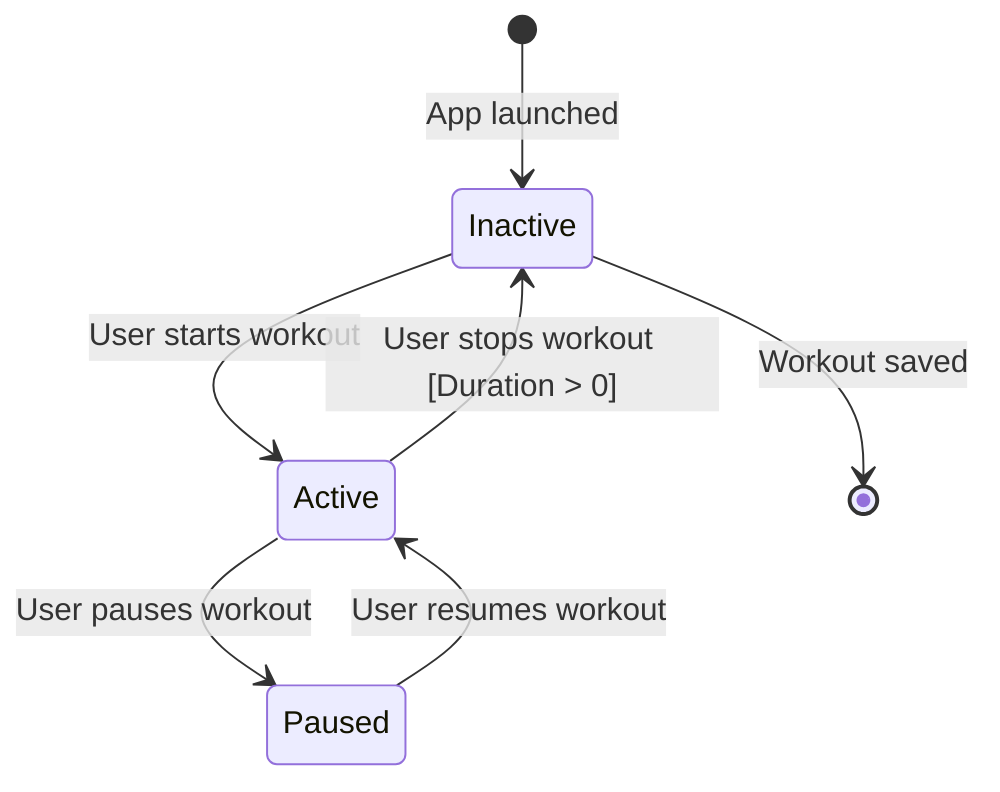
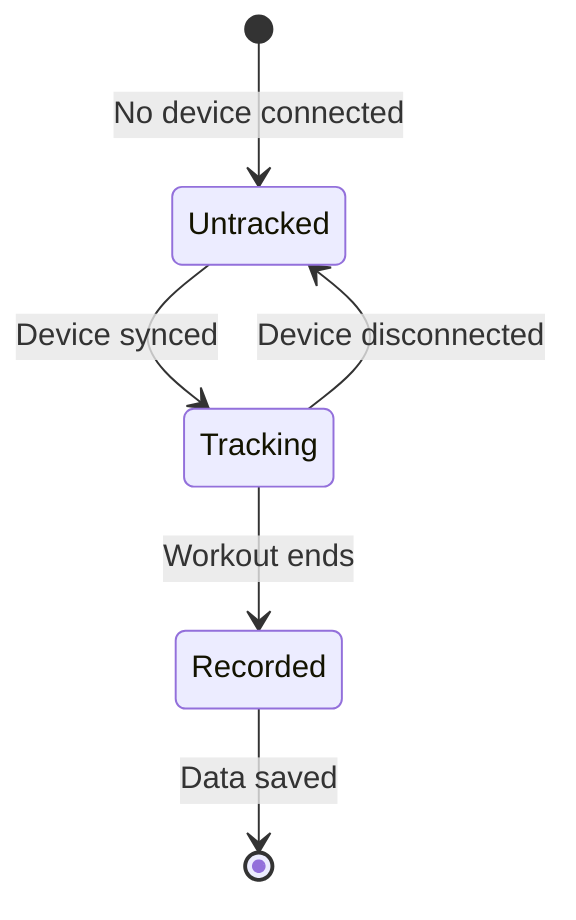
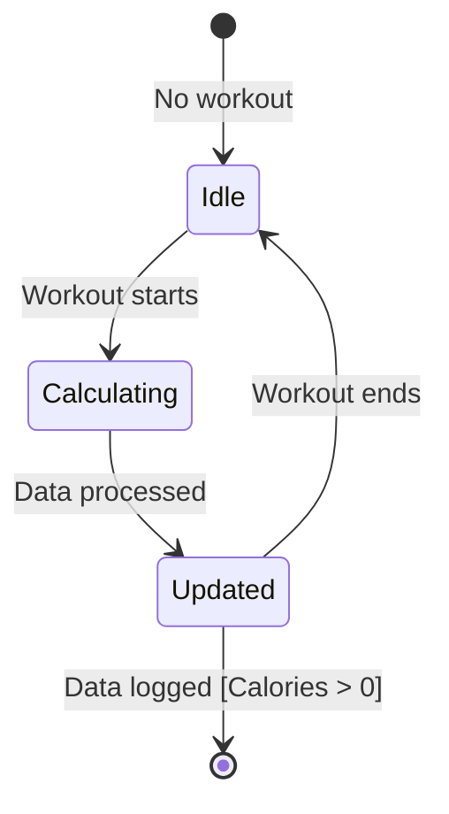
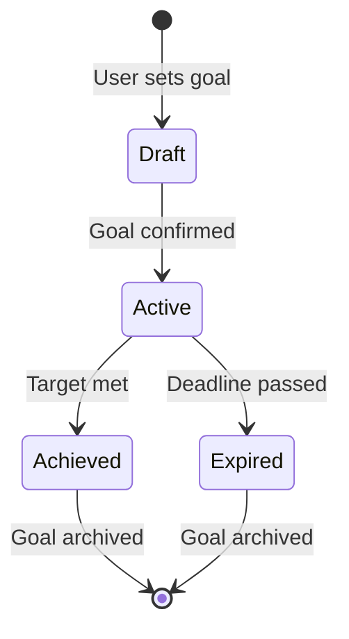
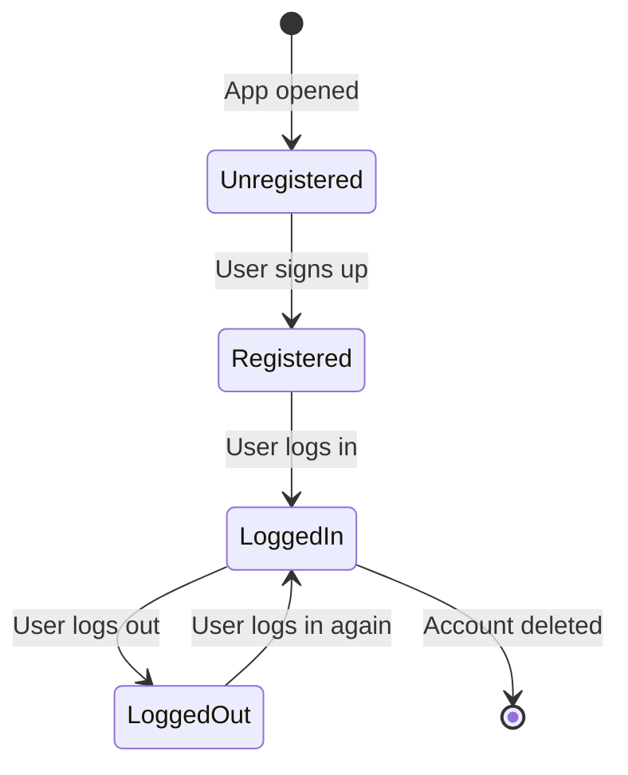
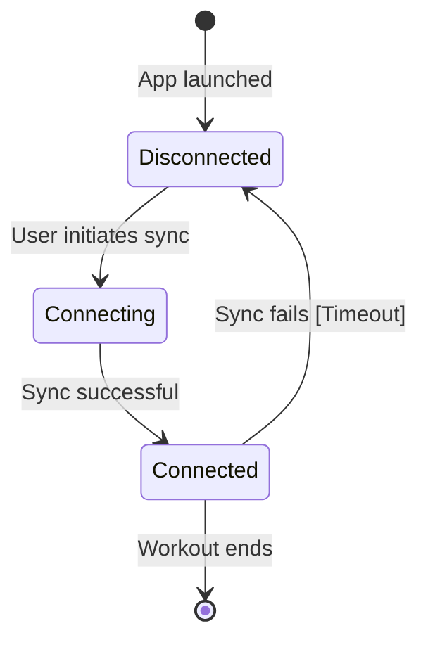
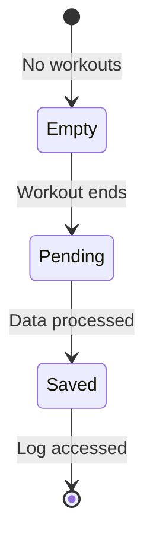

# state_transition_diagrams.md

## 1. Workout Session

**Explanation:** The "Workout Session" object starts as "Inactive" when the app launches. It transitions to "Active" when the user starts a workout (US-003, FR-003: Start/stop functionality). "Paused" allows temporary breaks, and stopping (with a guard condition ensuring duration) returns it to "Inactive" before saving, aligning with FR-004 (log activities).

## 2. Heart Rate Data

**Explanation:** "Heart Rate Data" begins "Untracked" until a device syncs (US-001, FR-001: Real-time tracking). It transitions to "Tracking" during a workout and to "Recorded" when it ends, saving data (FR-004), supporting accurate monitoring.

## 3. Calorie Data

**Explanation:** "Calorie Data" is "Idle" until a workout begins (US-002, FR-002: Calculate calories). It calculates in real-time, updates, and logs when the workout ends, ensuring FR-004 (activity logging).

## 4. Fitness Goal

**Explanation:** "Fitness Goal" starts as "Draft" (US-007, FR-007: Set goals), becomes "Active" when set, and ends as "Achieved" or "Expired," aligning with goal-tracking requirements.

## 5. User Account

**Explanation:** "User Account" supports registration and login (implied in FR-001 for user-specific data), transitioning between states for access control.

## 6. Device Connection

**Explanation:** "Device Connection" ensures accurate data (US-012, FR-012), moving to "Connected" only on a successful sync, with a timeout guard.

## 7. Activity Log

**Explanation:** The "Activity Log" tracks history (FR-004), transitioning from "Empty" to "Saved" as workouts are completed.

